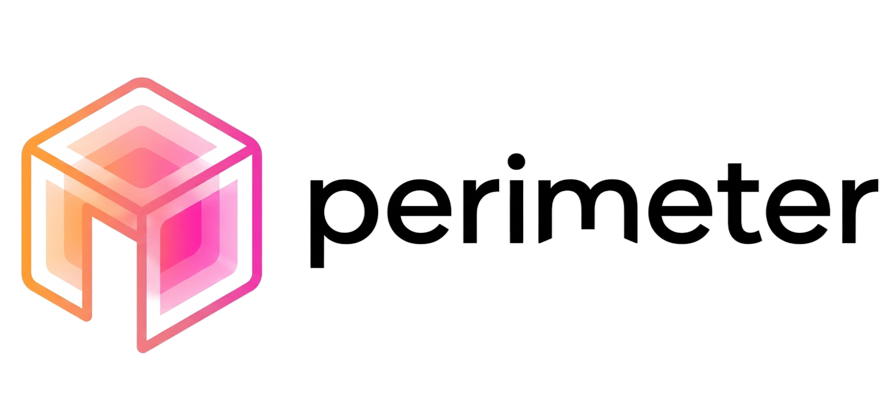

<div align="center">



# Smart indoor map Navigator (V2)

**ระบบแผนที่นำทางภายในอาคารอัจฉริยะสำหรับคณะวิทยาศาสตร์และเทคโนโลยี (CS333 / CS361)**

</div>

ยินดีต้อนรับสู่พื้นที่พัฒนาของโปรเจกต์ perimeter (ส่วนหนึ่งของรายวิชา CS333/CS361) ระบบแผนที่นำทางภายในอาคารอัจฉริยะสำหรับคณะวิทยาศาสตร์และเทคโนโลยีอาคาร บร.3 หรือ LC-3 
หากคุณคือผู้พัฒนาที่จะเข้ามาร่วมงานกับเรา เอกสารฉบับนี้คือสิ่งที่ทางเราแนะนำให้อ่านเพื่อทำความเข้าใจ Architecture และขั้นตอนการสร้าง Sandbox ส่วนตัวบน AWS ก่อนเริ่มรันระบบ
> [!TIP]
> **workflow ของโปรเจกต์ที่เราใช้คือ "Trunk-based development" และ "No ClickOps":** ทรัพยากรบน Cloud ทุกชิ้นต้องถูกจัดการด้วย Infrastructure as Code (IaC) ผ่านไฟล์ `template.yaml` เท่านั้น

## Live Demo & Core Features

[Live Demo (V2 Production บน AWS S3)](http://torch-v2-site-287785301136.s3-website-ap-southeast-1.amazonaws.com/)

**ฟีเจอร์หลักในเวอร์ชัน V2:**
- **Integrated Real LC-3 Schedules:** ผสานข้อมูลตารางเรียนและตารางใช้ห้องจริงของตึก LC-3 ประจำเทอมนี้ (อ้างอิงจากการลงพื้นที่สำรวจเก็บข้อมูลจริง)
- **Purpose-Based Search:** ค้นหาพิกัดห้องเป้าหมายได้ทันทีผ่าน "รหัสวิชา" (เช่น `CS361`) และ "เวลาเรียน"
- **Dynamic Schedules:** แสดงสถานะการใช้งานของแต่ละห้องแบบ Real-time ตามตารางที่ถูกเชื่อมต่อไว้
- **Interactive SVG Map:** แผนที่ตอบสนองการคลิก ซูม และเลื่อนโฟกัสไปที่เป้าหมายโดยอัตโนมัติ

> [!NOTE]
> **Upcoming Feature:** ระบบ Web-based CRUD สำหรับปรับปรุงและแก้ไขข้อมูลตารางเรียนผ่านหน้าเว็บ กำลังอยู่ในระหว่างการพัฒนา

## Architecture & Tech Stack


- **Frontend:** React 18, Vite, TypeScript, Tailwind CSS, GitHub Octicons (Hosted on AWS S3)
- **Backend & Compute:** AWS Lambda (Node.js 24.x) via Implicit API Gateway
- **Database:** Amazon DynamoDB (On-Demand Capacity)
- **Infrastructure as Code (IaC):** AWS SAM (`template.yaml`), `samconfig.toml`
- **Data & Tooling:** Node.js Scripts สำหรับ Validator และนำเข้าข้อมูล (Data Seeding)
- **CI/CD:** GitHub Actions (Automated Linting, Vitest, และ Automated Deployment)

### Environments

| Environment | Account | Region | Who Deploys | Lifetime | Credentials |
| :-- | :-- | :-- | :-- | :-- | :-- |
| **Dev** | AWS Academy Learner Lab | `us-east-1` | Teammate (Local via `sam deploy --config-env dev`) | Temporary (4 hours) | Temporary Session Token |
| **Prod** | Real AWS Free Tier Account | `ap-southeast-1` | GitHub Actions CI/CD (`sam deploy --config-env prod`) | Persistent | OIDC Role (Least-privilege) |

> [!IMPORTANT]
> **Production Seeding & Deployment:** ดำเนินการผ่าน GitHub Actions CD Pipeline เท่านั้น บัญชี Production ไม่อนุญาตให้ใช้ Static Access Keys หรือส่ง Request จาก Local Dev โดยตรง

## Developer Quickstart (วิธีรันและทดสอบระบบ)

โปรเจกต์นี้ทำงานแบบ Serverless 100% เพื่อไม่ให้กวน Production ทีมงานทุกคนต้องสร้าง Sandbox บนบัญชี AWS Academy ของตัวเองก่อนเริ่มพัฒนา

### 1. Pre-requisites (สิ่งที่ต้องมี)
- ติดตั้ง **Node.js**, **AWS SAM CLI** และ **AWS CLI** ในเครื่อง
- **ข้อควรระวัง:** บัญชี AWS Academy เลิกเชื่อมต่อทุกๆ 4 ชั่วโมง เมื่อเปิด Lab ใหม่ ต้องกดก๊อปปี้ AWS Credentials มาวางใน Terminal เสมอ

### 2. The "Magic" Command
คิดไม่ออกว่าจะรันระบบยังไง ให้เปิด Terminal ที่โฟลเดอร์นอกสุด (Root) แล้วรันคำสั่งเดียวนี้:
```bash
npm run bootstrap

```

**คำสั่งเดียวนี้ทำอะไรให้บ้าง?**

* `sam build & deploy`: สร้าง Lambda, API Gateway, DynamoDB และ S3
* `seed`: นำเข้าข้อมูลห้องและตารางเรียนจริงเข้า DynamoDB ของคุณ
* `env:pull`: ดึง API URL มาใส่ใน `frontend/.env.local` ให้อัตโนมัติ (ไม่ต้องก๊อปมาวางเอง)
* `site:publish`: Build และ Publish หน้าเว็บของคุณขึ้น S3 ทันที

### 3. Cheat Sheet (คำสั่งที่ใช้บ่อย)

| หากต้องการทำสิ่งนี้... | ให้รันคำสั่งนี้ |
| --- | --- |
| **รันเว็บทดสอบในเครื่อง (Local)** | `npm run dev` (ข้างในโฟลเดอร์ frontend) |
| **ทดสอบเว็บบนมือถือ (Local Network)** | `npm run dev -- --host` (แล้วเข้าผ่าน URL ที่ปรากฏ) |
| **อัปเดต Tech Stack / Lambda** | `npm run bootstrap` |
| **อัปเดตเฉพาะหน้าบ้าน (Frontend)** | `npm run site:publish` |
| **อัปเดตข้อมูล Data ในฐานข้อมูล** | `npm run seed` |
| **ล้างระบบทิ้งทั้งหมด (Clean up)** | รัน `npm run site:empty` แล้วตามด้วย `sam delete` |

> [!IMPORTANT]
>(สำคัญ: ต้องรัน `npm run site:empty` ก่อนลบ Stack เสมอ ไม่งั้นจะลบไม่ผ่านเพราะ S3 Bucket ยังมีไฟล์อยู่)

### 4. AI-Assisted Development (Matt Pocock Skills)

โปรเจกต์นี้ติดตั้ง Workflow ของ AI Agent ไว้เพื่อช่วยให้ทีมเขียนโค้ดและวางแผนได้รวดเร็วขึ้น สามารถเรียกใช้ผ่านแชทด้วย Slash Commands:

* **`/grill-with-docs`**: ใช้สัมภาษณ์/พูดคุยเพื่อรีดไอเดียและสร้าง Spec ให้ชัดเจนก่อนเริ่มเขียนโค้ด
* **`/to-spec` & `/to-tickets`**: สั่งแปลงบทสนทนาเป็น Technical Spec และแบ่งเป็น Ticket ย่อยๆ
* **`/tdd` หรือ `/implement`**: สั่งให้ AI ลงมือเขียนโค้ดตาม Spec หรือทำ Test-Driven Development ให้ทันที

## Testing & CI/CD

* **Frontend Tests:** รัน `npm test` (Unit & Component Tests) และ `npm run lint`
* **Backend / IaC:** รัน `sam validate` (ตรวจ template.yaml)
* **CI/CD Pipeline:** เมื่อเปิด PR ระบบ **CodeRabbit** จะรีวิวโค้ดอัตโนมัติ และเมื่อ Merge ลง `main` แล้ว GitHub Actions จะ Deploy โค้ดขึ้น Production ให้อัตโนมัติ
