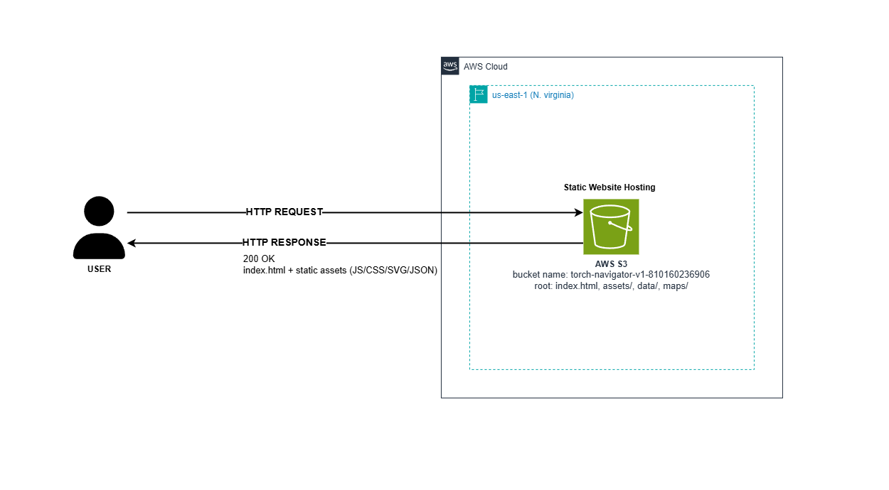

#  TORCH: Smart Faculty Navigator (V1)

**TORCH** คือระบบแอปพลิเคชันแผนที่นำทางภายในอาคารเรียน (Software-defined Indoor Navigation System) สำหรับคณะวิทยาศาสตร์และเทคโนโลยี สร้างขึ้นเพื่อแก้ไขปัญหาป้ายบอกทางที่ไม่ชัดเจน และชื่อเรียกห้องที่หลากหลาย (เช่น ห้อง 103, LC3-103, ห้องบรรยาย 1) ซึ่งทำให้เกิดความสับสน

โครงการนี้เป็นส่วนหนึ่งของรายวิชา **CS361**

🔗 **[Live Demo (V1 Production บน AWS S3)](http://torch-navigator-v1-810160236906.s3-website-us-east-1.amazonaws.com/)**

---

## Core Requirements & Features (V1)

ระบบ V1 ถูกพัฒนาขึ้นเพื่อตอบสนองการใช้งานหลัก (Core User Path) ดังต่อไปนี้:

1. **Smart Search (Synonym Dictionary):** ค้นหาห้องด้วยรหัส, ชื่อ หรือ Keyword ทั่วไปได้อย่างแม่นยำ
2. **Category Filtering:** กรองห้องพักอาจารย์, ห้องบรรยาย, ห้องทดลอง ฯลฯ ได้รวดเร็วผ่าน Filter Pills
3. **Interactive Map Tracking:** แผนที่ SVG ที่สามารถตอบสนองและเปลี่ยนจุดโฟกัส (Auto-Pan) ไปยังห้องเป้าหมายได้อัตโนมัติเมื่อกดค้นหา
4. **Contextual Detail Modal:** แสดงข้อมูลห้องและ **จุดสังเกตใกล้เคียง (Landmarks)** เพื่อช่วยในการนำทางจริง
5. **Decoupled Map State:** เมื่อปิด Modal รายละเอียดห้อง หมุด (Pin) บนแผนที่จะยังคงแสดงผลอยู่ เพื่อให้ผู้ใช้ยังคงเห็นตำแหน่งห้องขณะ Zoom/Pan แผนที่
6. **Responsive UI:** รองรับการแสดงผลทั้งบน Desktop (Floating Card) และ Mobile (Bottom Sheet ที่แก้ปัญหา `100dvh` Viewport เรียบร้อยแล้ว)

---

## Architecture & Tech Stack



- **Frontend Framework:** React + Vite + Typescript
- **Styling:** Tailwind CSS
- **Data Architecture:** Static `rooms.json` (131+ records)
- **State Management:** React Hooks (`useState`, `useMemo`, `useCallback`)
- **Testing:** Node Test Runner / Vitest
- **Deployment:** AWS S3 (Static Website Hosting)

---

## 📂 Project Structure (สำหรับ Developer)

```text
frontend/
├── public/                # ข้อมูล Static และแผนที่
│   ├── data/
│   │   └── rooms.json     # ข้อมูล Data Source หลักของห้อง (ห้ามแก้ไขโดยตรง)
│   └── maps/              # ไฟล์ Interactive SVG ของแผนที่แต่ละชั้น
├── src/
│   ├── assets/            # ไฟล์รูปภาพและโลโก้ TORCH
│   ├── components/        # UI Components ทั้งหมด (ทำงานหลักที่นี่)
│   │   ├── MapContainer.tsx
│   │   ├── RoomDetailModal.tsx
│   │   ├── RoomSearchPanel.tsx
│   │   └── ...
│   ├── hooks/             # Custom Hooks (เช่น useRooms.ts)
│   ├── services/          # Data fetching & Normalization
│   ├── types/             # TypeScript Interfaces
│   ├── App.tsx            # Root Component
│   └── main.tsx           # Entry Point
└── vite.config.ts         # Vite Config
```

## Quick Start (การติดตั้งและทดสอบระบบ)

### 1. Install Dependencies

```bash
cd frontend
npm install
```

### 2. รัน Development Server (Local)

```bash
npm run dev
```

> เปิดเว็บเบราว์เซอร์และเข้าไปที่ `http://localhost:5173`

### 3. การทดสอบบนมือถือเครื่องจริง (Local Network Testing)

หากต้องการทดสอบ Responsive UI บนมือถือหรือแท็บเล็ตที่อยู่ใน Wi-Fi เดียวกัน:

```bash
npm run dev -- --host
```

> นำ URL ที่แสดงในช่อง `Network:` ของ Terminal (เช่น `http://192.168.1.x:5173`) ไปเปิดบน Browser ของมือถือ

## Testing & Code Quality

ทีมพัฒนาใช้คำสั่งเหล่านี้ในการควบคุมคุณภาพของโค้ด:

| คำสั่ง | คำอธิบาย |
| --- | --- |
| `npm test` | รัน Unit / Component Tests |
| `npm run lint` | ตรวจสอบ Code Style (ESLint) |
| `npm run build` | ตรวจสอบ TypeScript Errors และสร้าง Production Build |


