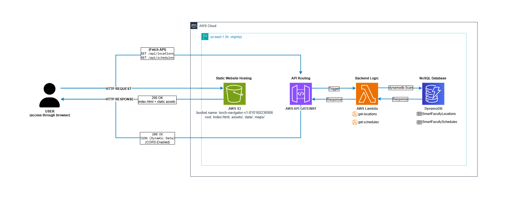

# TORCH: Smart Faculty Navigator (V2)

**TORCH** คือระบบบริการข้อมูลและแผนที่นำทางภายในอาคารเรียน (Software-defined Indoor Navigation & Information Service) สำหรับคณะวิทยาศาสตร์และเทคโนโลยี สร้างขึ้นเพื่อแก้ไขปัญหาป้ายบอกทางที่ไม่ชัดเจน และช่วยให้นักศึกษาและคณาจารย์เข้าถึงข้อมูลห้องเรียน ตารางเรียน และตารางสอบได้อย่างแม่นยำ

โครงการนี้เป็นส่วนหนึ่งของรายวิชา **CS333 / CS361**

🔗 **[Live Demo (V1 Production บน AWS S3)](http://torch-navigator-v1-810160236906.s3-website-us-east-1.amazonaws.com/)**

---

## Core Features & Scope

ระบบ V2 ต่อยอดจากสถาปัตยกรรม V1 สู่ระบบ Dynamic Cloud Service เต็มรูปแบบ:

1. **Purpose-Based Search (New in V2):** ค้นหาห้องจากรหัสวิชา (เช่น `CS111`, `CS361`) หรือชื่อกิจกรรม เพื่อระบุห้องเรียน/ห้องสอบ พร้อมปักหมุดบนแผนที่อัตโนมัติ
2. **Dynamic Class & Exam Schedules (New in V2):** เชื่อมโยงข้อมูลตารางการใช้ห้องจริง (Ground Truth Data) จาก Cloud Database เพื่อแสดงสถานะการใช้งานของห้อง
3. **Smart Search & Synonyms:** ค้นหาห้องด้วยรหัสห้อง ชื่อทางการ หรือชื่อเรียกทั่วไปได้อย่างแม่นยำ
4. **Interactive SVG Map & Auto-Pan:** แผนที่ SVG ที่ตอบสนองการคลิก ซูม และเลื่อนตำแหน่งโฟกัสไปยังห้องเป้าหมายโดยอัตโนมัติ พร้อมสลับชั้น 1 และ 2
5. **Decoupled Map State:** หมุดตำแหน่งห้อง (Pin) ยังคงปักอยู่บนแผนที่แม้จะปิด Modal รายละเอียด เพื่อให้ผู้ใช้สำรวจเส้นทางได้สะดวก
6. **Responsive Spatial UI:** รองรับ Desktop (Floating Side Card) และ Mobile (Bottom Sheet ที่รองรับ `100dvh` Viewport)

---

## Architecture & Tech Stack


* **Frontend:** React 18, Vite, TypeScript, Tailwind CSS (Hosted on AWS S3)
* **Backend & Compute:** AWS Lambda (Node.js 24.x) via Implicit API Gateway
* **Database:** Amazon DynamoDB (On-Demand Capacity)
* **Infrastructure as Code (IaC):** AWS SAM (`template.yaml`), `samconfig.toml`
* **Data & Tooling:** Node.js Scripts for CSV/JSON validation and DynamoDB batch seeding
* **CI/CD:** GitHub Actions (Automated Linting, Vitest, and `sam deploy`)

---

## 📂Project Structure (Monorepo)

```text
CS333-CS361-Smart-Faculty-Navigator/
├── frontend/                  # React client application
│   ├── public/
│   │   └── maps/              # Interactive SVG floor plans
│   ├── src/
│   │   ├── assets/            # รูปภาพและโลโก้ TORCH
│   │   ├── components/        # UI Components (MapContainer, SearchBar, RoomDetailModal, ...)
│   │   ├── hooks/             # Custom Hooks (useRooms, useSchedules, ...)
│   │   ├── services/          # API Services & Normalization (roomsService, schedulesService)
│   │   ├── types/             # TypeScript Interfaces
│   │   ├── App.tsx            # Root Component
│   │   └── main.tsx           # Entry Point
│   └── vite.config.ts
├── functions/                 # AWS Lambda source code (One directory per function)
│   ├── get-locations/         # GET /api/locations — ดึงข้อมูลสถานที่จาก DynamoDB
│   │   └── index.mjs
│   └── get-schedules/         # GET /api/schedules — ดึงข้อมูลตารางเรียนจาก DynamoDB
│       └── index.mjs
├── tools/                     # Data extraction & Seeding scripts
│   └── data-extraction/
│       └── lc3/               # LC3 ground truth data (Seeds, CSVs, Validators)
├── template.yaml              # AWS SAM Template (IaC)
├── samconfig.toml             # SAM deployment settings (Safe for VCS)
└── README.md

```

---

## Developer Routine (How to Run & Develop)

โปรเจกต์นี้ทำงานแบบ Full-Stack Serverless เพื่อให้ทุกคนทดสอบระบบได้ 100% โดยไม่กวน Production ให้ทำตาม 5 ขั้นตอนนี้ตามลำดับ:

### 🛑 กฎสำคัญของทีม: ห้ามกดสร้าง Resource เองบน AWS Console (No ClickOps)

ทีมของเราอาจคุ้นเคยกับการกดสร้าง DynamoDB หรือตั้งค่าต่างๆ ผ่านหน้าเว็บ AWS (ClickOps) แต่สำหรับ V2 เราจะเปลี่ยนมาใช้ **Infrastructure as Code (IaC)** เต็มรูปแบบ

**💡 คลายข้อสงสัย: แล้วยังต้องเข้าเว็บ AWS Academy อยู่ไหม?**

* **ยังต้องเข้าเว็บไปกด "Start Lab" อยู่:** เพื่อเป็นการเปิดสวิตช์การทำงานของบัญชี และก๊อปปี้ Credentials ชั่วคราว (`AWS_ACCESS_KEY_ID`, `AWS_SECRET_ACCESS_KEY`, `AWS_SESSION_TOKEN`) มาใส่ใน Terminal ของเครื่องคอมพิวเตอร์เรา
* **แต่หลังจากนั้นให้ "ปิดหน้าเว็บทิ้งได้เลย":** ห้ามใช้เมาส์คลิกสร้าง Bucket, DynamoDB Table, API Gateway หรือ Lambda ผ่านหน้าจอ AWS Console เด็ดขาด

การสร้าง Cloud Infrastructure ทั้งหมดจะย้ายมาอยู่ที่ **VSCode Terminal** (หรือ Command Prompt) แทน เราจะเขียนสเปกของคลาวด์ทุกอย่างลงในไฟล์ `template.yaml` แล้วใช้คำสั่ง `sam deploy` ให้ AWS ก่อสร้างทุกอย่างตามโค้ดโดยอัตโนมัติ (นี่คือที่มาของคำว่า Infrastructure as Code)

**ทำไมต้องบังคับใช้ IaC?**

1. **แก้ปัญหาฝันร้ายตอนรวมโค้ด:** หากคุณแอบไปกดสร้าง Resource บน Console เอง ระบบ CI/CD (GitHub Actions) จะ "ตาบอด" และไม่รู้ว่าคุณทำอะไรไปบ้าง เมื่อคุณโยนโค้ดมาให้ Tech Lead กด Merge ระบบ Production จะพังทันทีเพราะการตั้งค่าบน Cloud ไม่ตรงกับโค้ด
2. **ป้องกัน Human Error:** มนุษย์กด UI 10 ครั้งไม่มีทางเหมือนกันทุกครั้ง (เช่น ลืมตั้งค่า CORS หรือพิมพ์ชื่อ Table ผิด) การใช้ไฟล์ `template.yaml` เปรียบเสมือนการใช้ "พิมพ์เขียว (Blueprint)" แผ่นเดียวกัน ทำให้สถาปัตยกรรมของทุกคนเป๊ะ 100%
3. **Automated Deployment:** ทันทีที่คุณอัปเดตไฟล์ `template.yaml` คำสั่ง `sam deploy` จะอ่านพิมพ์เขียวนี้และก่อสร้าง Resource ทุกชิ้นขึ้นบน AWS Learner Lab ของคุณให้อัตโนมัติในไม่กี่นาที

---

### Step 1: Initial Setup (ทำครั้งแรกครั้งเดียว)

ติดตั้ง Dependencies สำหรับฝั่งหน้าบ้าน (Frontend):

```bash
cd frontend
npm install

```

### Step 2: สร้าง Backend ของตัวเอง (Personal Sandbox)

**ทำไมต้องทำขั้นตอนนี้?** เพื่อไม่ให้การทดสอบระบบของคุณไปกวนการทำงานของเพื่อน หรือเผลอไปทำข้อมูลบน Production พัง ทุกคนจึงต้องสร้าง Sandbox ส่วนตัวบนบัญชี AWS Academy Learner Lab ของตัวเอง เอาไว้ใช้สำหรับ Dev & Test ฟีเจอร์ที่ตัวเองรับผิดชอบโดยเฉพาะ

เมื่อมีการเขียนโค้ด Lambda ใหม่ หรือแก้ไข `template.yaml`:

1. เปิด Terminal ที่ Root folder แล้วรัน:

```bash
sam deploy --guided

```

2. ทำตามขั้นตอนบนหน้าจอเพื่อสร้าง API และ Database ขึ้นบน **AWS Academy Learner Lab ของตัวเอง**
3. **สำคัญมาก:** เมื่อ Deploy เสร็จ ให้สังเกตตาราง `Outputs` ใน Terminal มันจะแสดง URL ของ API Gateway (เช่น `[https://xyz123.execute-api.us-east-1.amazonaws.com/api/](https://xyz123.execute-api.us-east-1.amazonaws.com/api/)...`) **ให้ Copy Base URL นี้เก็บไว้**
4. รัน Script เพื่ออิมพอร์ตข้อมูลจำลองเข้า Database ในบัญชีของคุณ:

```bash
node tools/data-extraction/lc3/seed-dynamodb.mjs

```

### Step 3: เชื่อมหน้าบ้านเข้ากับหลังบ้าน (Environment Variables)

**ทำไมต้องมีไฟล์ .env และมันต่างกันอย่างไร?**

* `.env.example`: คือ "ไฟล์แม่แบบ" ที่แชร์กันใน Git เพื่อให้ทุกคนรู้ว่าโปรเจกต์นี้ต้องใช้ตัวแปรอะไรบ้าง (แต่ไม่มีค่าจริงอยู่ข้างใน)
* `.env.local`: คือ "ไฟล์ส่วนตัวของคุณ" ที่ Git จะไม่สนใจ (Untracked) เราใช้ไฟล์นี้เพื่อให้ API URL ของคุณไม่ไปทับกับของเพื่อนตอน Merge โค้ด

*(💡 **ต้องทำขั้นตอนนี้ทุกครั้งที่แตก Branch ใหม่ไหม?** ตอบ: **ไม่ต้อง!** ทำแค่ครั้งเดียว ตราบใดที่คุณยังใช้ API ตัวเดิมบน AWS ของคุณ URL นี้จะคงเดิมเสมอ แตก Branch ใหม่ก็รันโค้ดต่อได้เลย)*

1. เข้าไปที่โฟลเดอร์ `frontend/`
2. Copy ไฟล์ `.env.example` แล้วเปลี่ยนชื่อเป็น `.env.local`
3. เปิดไฟล์ `.env.local` แล้วเอา URL ที่ Copy จาก Step 2 มาวาง:

```env
VITE_API_BASE_URL=https://xyz123.execute-api.us-east-1.amazonaws.com

```

### Step 4: รันและทดสอบระบบ (Local Server)

1. รันเซิร์ฟเวอร์จำลองหน้าเว็บ (ให้แน่ใจว่าอยู่ในโฟลเดอร์ `frontend/`):

```bash
npm run dev

```

2. เปิดบราวเซอร์ที่ `http://localhost:5173` หน้าเว็บของคุณจะทำงานโดยดึงข้อมูลจริงจาก Database บน AWS ของคุณเอง!
*(💡 หากต้องการเทสบนมือถือ ให้รัน `npm run dev -- --host` แล้วเข้าผ่าน URL ในช่อง Network)*

### Step 5: เปิด Pull Request & Deploy to Production

1. เมื่อเทสในเครื่องตัวเองผ่านหมดแล้ว ให้ Commit โค้ดและเปิด Pull Request (PR) เข้า Branch `main`
2. เมื่อ PR ถูกตรวจสอบและ Merge สำเร็จ ระบบ CI/CD (GitHub Actions) จะนำโค้ด `template.yaml` ชุดเดียวกันนี้ ไปรันสร้างและอัปเดตระบบบน **บัญชี Production หลัก** ให้อัตโนมัติ

---

## Testing & Code Quality

ทุกการเปลี่ยนแปลงต้องผ่าน Automated Checks ทั้งหมดก่อนที่จะสามารถ Merge เข้าสู่ Branch `main`:

| Scope | คำสั่ง | คำอธิบาย |
| --- | --- | --- |
| Frontend | `npm test` (ใน `frontend/`) | รัน Unit & Component Tests ทั้งหมด |
| Frontend | `npm run lint` (ใน `frontend/`) | ตรวจสอบ Code Style และข้อผิดพลาดด้วย ESLint |
| Frontend | `npm run build` (ใน `frontend/`) | ตรวจสอบ TypeScript Types และสร้าง Production Bundle |
| Backend / IaC | `sam validate` (ที่ Root) | ตรวจสอบ Syntax และ Schema ของไฟล์ `template.yaml` |